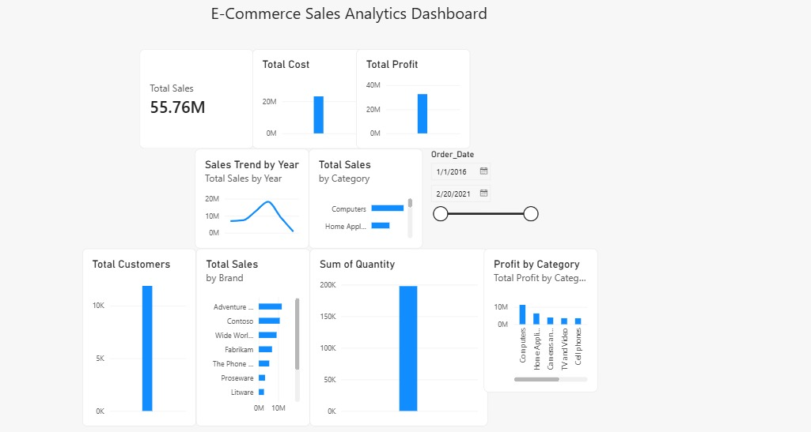

# E-Commerce Sales Analytics Dashboard

## 📊 Project Overview

An interactive E-Commerce Sales Analytics Dashboard built using **MySQL and Microsoft Power BI** to analyze sales performance, profitability, customers, products, brands, and stores.

The project transforms raw e-commerce data into meaningful business insights through data modeling, KPI analysis, and interactive visualizations.

## 🛠️ Tools & Technologies

* **MySQL** — Database management and data storage
* **Microsoft Power BI** — Data visualization and dashboard development
* **Microsoft Excel / CSV** — Source data

## 📈 Key KPIs

The dashboard tracks the following key business metrics:

* **Total Sales**
* **Total Cost**
* **Total Profit**
* **Total Orders**
* **Total Customers**

## 📊 Dashboard Features

* Sales Trend by Year
* Sales by Product Category
* Profit by Product Category
* Top 10 Brands by Sales
* Interactive Year Filter
* KPI cards for quick business performance analysis

## 🖼️ Dashboard Preview

## 🔍 Key Analysis

The dashboard allows users to explore sales and profitability across different years, product categories, and brands.

Interactive filtering makes it possible to analyze business performance for specific time periods and identify high-performing product segments and brands.

## 📁 Project Files

* `Ecommerce_Sales_Analytics_Portfolio.pbix` — Power BI dashboard file
* `dashboard.jpeg` — Dashboard preview

## 🎯 Project Objective

The goal of this project is to demonstrate practical skills in **SQL, data analysis, data modeling, and Power BI dashboard development** by converting raw e-commerce data into an interactive business intelligence solution.

